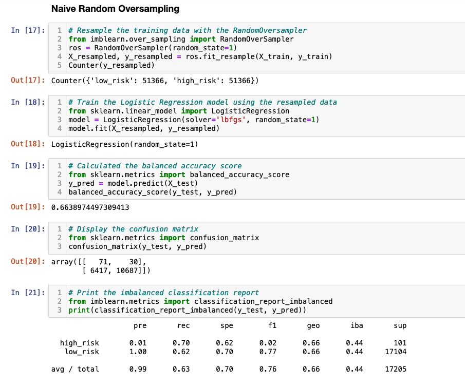
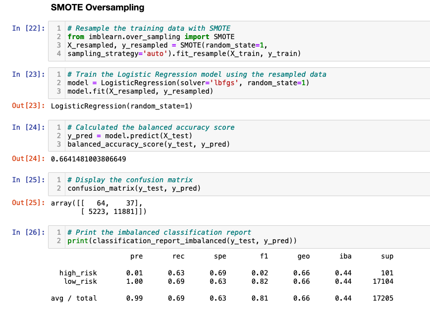
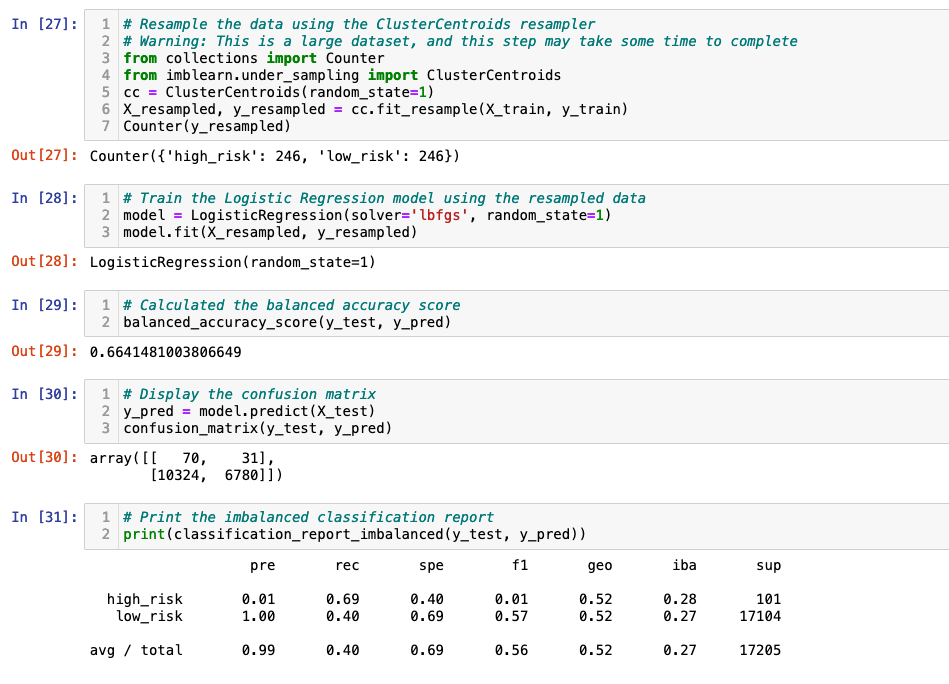
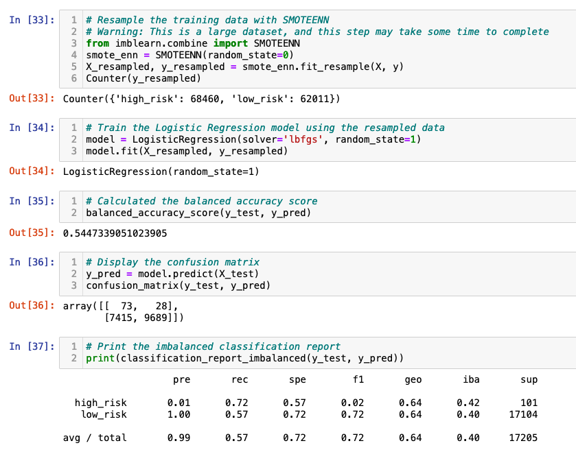
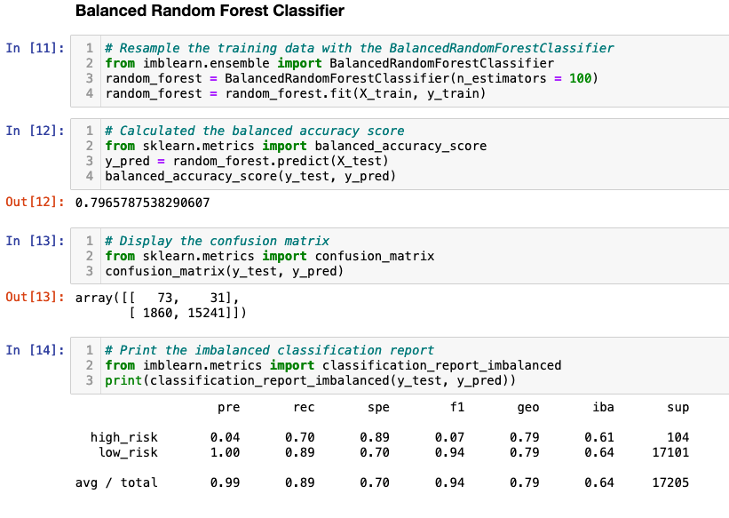
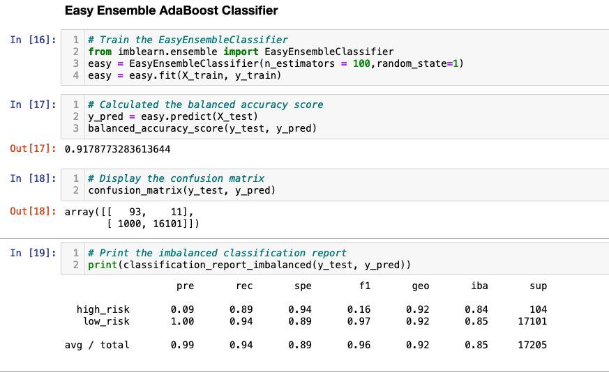

# Credit Risk Analysis

## Overview
In this project, I needed analyze and predict whether someone is low or high risk based on the factors present in the 2019Q1 loan stats csv file provided.  To do this I created a model, then evaluated and trained the models that they create. I utilized the tools from the imbalanced0-learn and scikit-learn libraries to build the models and use a resampling method to evaluate them.  For some of the models, I oversampled the data using randomoversampler and SMOTE algorithms and undersampled the data with the clustercentroid algorithm.

## Results
* Naive Random Oversampling results: The balanced accuracy score is 66%.  The precision for the high_risk loans has a precision of 1% and a recall of 70%

* SMOTE Oversampling results: The balanced accuracy score is 66.4%.  The precision for the high_risk loans is also 1% and has a recall of 63%

* Undersampling results: The balanced accuracy score is 66.4%.  The precision for the high_risk loans is, again, 1% and has a recall of 69%

* Combination results: The balanced accuracy score is 54.5%.  The precision for the high_risk loans is 1% and has a recall of 72%

* Balanced Random Forest Classifier results: The balanced accuracy score is 80%.  The precision for the high_risk loans is 4% and has a recall of 70%

* Easy Ensemble AdaBoost Classifier results: The balanced accuracy score is 91.8%.  The precision for the high_risk loans is 9% and has a recall of 89%

Desirable models need a good balance of recall and precision. This is why I recommend the easy ensemble classifiers over the first four models, since it had the best balance of all the models with its high accuracy score and precision/recall scores.
